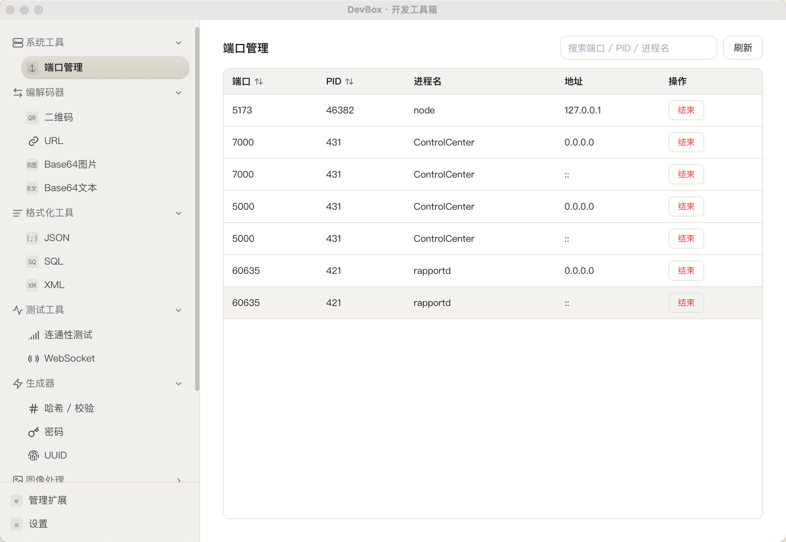

# DevBox · 开发工具箱

本地开发者工具集（DevToys 风格）桌面应用：左侧导航 + 右侧工具页。基于 **Wails v2（Go 后端 + Vue 3 前端）** 构建。

> 本仓库由同工作空间的 Tauri 版（`fs-tauri/DevBox`）迁移而来：前端 UI / 样式 / 路由 / store 整体保留，后端 Rust 命令改写为 Go 方法，前端交互层从 Tauri invoke / plugin 改为 Wails binding / runtime。



## 功能工具

| 分组 | 工具 | 实现位置 |
|---|---|---|
| 系统工具 | 端口管理（列表 / 结束进程） | Go |
| 编解码器 | 二维码（生成 / 解码）、URL 编解码、Base64 图片、Base64 文本 | Go |
| 格式化工具 | JSON、SQL、XML | 前端 |
| 测试工具 | 连通性测试（Ping / TCP 端口）、WebSocket | 连通性 Go / WebSocket 前端 |
| 生成器 | 哈希校验（MD5/SHA1/SHA256/SHA384/SHA512）、密码生成、UUID（v4/v7） | Go |
| 文本处理 | 转义 / 反转义、列表比对、Markdown 预览 | 占位页（Coming Soon） |
| 图像处理 | — | 占位组 |
| 设置 | 主题切换（浅色 / 深色） | 前端 |

需要跨语言一致性或调用系统能力的工具（编解码、哈希、UUID、端口、Ping）逻辑下沉到 Go；纯展示型工具（JSON/SQL/XML 格式化、WebSocket 客户端、主题）在前端完成，无 Go binding。

## 技术栈

| 层 | 技术 |
|---|---|
| 前端 | Vue 3 + Pinia + Vue Router + Naive UI + Tailwind CSS + Vite |
| 后端 | Go + Wails v2 |
| 通信 | Wails binding（`frontend/wailsjs/go/main/App`）+ runtime（事件 / 剪贴板） |

## 常用命令

```bash
# 桌面应用（开发模式，热重载）
wails dev

# 产出安装包到 build/bin/
wails build

# 仅前端（纯 UI 调试，但 binding 调用会失败 — 桌面 IPC 需要 Wails 进程）
cd frontend && pnpm dev

# 类型检查 / 单测
cd frontend && pnpm exec vue-tsc --noEmit       # 前端类型检查
go test ./...                                    # Go 后端单测（对齐原 Rust 单测）
```

## 架构

```
前端 frontend/src/  ──▶  src/api/*.ts  ──▶  wailsjs/go/main/App.*  ──▶  Go 方法（App struct，tools_*.go）
```

- **后端命令**挂在 `App` struct（`app.go` + `tools_*.go`），按工具拆分文件，同 `package main`。
- **前端 API 层** `src/api/*.ts` 是单一调用入口，内部转发到 Wails 生成的 binding，对外签名与原 Tauri 版一致。
- **剪贴板 / 事件**用本地 `wailsjs/runtime/runtime`；**文件对话框**由 Go 端 `OpenDialog`/`SaveDialog` binding 包装；**文件读写**由 `ReadFile`/`ReadTextFile`/`WriteFile` binding 提供，`src/api/fs.ts` 封装对齐原 Tauri plugin-fs 签名。
- **主题**由 `stores/theme.ts` 管理，`<html data-theme>` 切换，`tokens.css` 用 `[data-theme='dark']` 覆盖颜色变量，Naive UI 在 `App.vue` 按主题传 `darkTheme`。

更多架构与约束见 [`CLAUDE.md`](CLAUDE.md)，UI 视觉与交互见 [`DESIGN.md`](DESIGN.md)。

## License

MIT，见 [LICENSE](LICENSE)。
